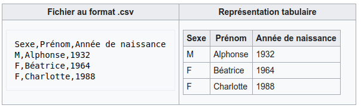

:title: Projet Kot-Line
:description: Cours et TP autour de Spring Boot
:keywords: Spring Boot Kotlin langage programmation web
:authors: Olivier Capuozzo et confrères
:email:
:revnumber: v1.1
:revdate: 05/11/2022
:imagesdir: images
:imagesoutdir: images

ifdef::env-github[]
:tip-caption: :bulb:
:note-caption: :information_source:
:important-caption: :heavy_exclamation_mark:
:caution-caption: :fire:
:warning-caption: :warning:
:imagesdir: .
endif::[]

// Activation de la numérotaion des section :
:sectnums:
:tabsize: 2

:toc: left
:toclevels: 5
:toc-title: Sommaire

= Projet: https://ldv-melun.github.io/projet-kot-line/[Kot-Line]

== Contexte

La société de service SO-DEV dans laquelle vous travaillez a comme client l'entreprise Kot-Line, créatrice de ligne de vêtements.

La société Kot-Line reçoit de la part de ses partenaires, tous les mois, 2 fichiers clients au format https://fr.wikipedia.org/wiki/Comma-separated_values[`CSV`].

Afin d'exploiter ces fichiers partenaires, Kot-Line souhaite disposer d'un outil (une application web), disponible qu'aux gestionnaires, lui permettant d'intégrer les données de ces fichiers dans une base de données relationnelle.

L'entreprise Kot-Line envisage de se lancer dans des produits en liens avec l'automobile.

Le département R&D vous demande de concevoir un premier prototype d'application.

== Première partie : Analyse

Votre mission consiste donc à concevoir une application web, qui sera disponible dans l'intranet de l'entreprise Kot-Line.

L'application devra permettre

. La consultation, par toute personne de l'entreprise, de la base de données clients.
. La possibilité de télécharger, par un personnel _gestionnaire_, un fichier client CSV (upload), afin de peupler une base de données et retourner à l'utilisateur des éléments statistiques résultants de l'opération engagée par l'utilisateur.

Pour cela vous définirez le *modèle conceptuel du domaine* (MCD) représenté par un diagramme de classes des entités métier (classes `entity`).

Votre travail préalable consiste à étudier

* Comment réaliser les relations entre vos objets du domaine.
* Comment permettre à un utilisateur de télécharger un fichier CSV
* Comment lire un fichier CSV et en exploiter ses données
* Comment implémenter les contraintes (une solution classique consiste à concevoir des fonctions dans une classe à part et placer cette classe dans un dossier (package) nommé `service`, de même niveau d'arborescence que `controller`, puis injecter une instance de cette classe selon les besoins)
* Comment insérer les données ainsi filtrées dans une base de données de tests (MySql)
* Quelles seront les données statistiques retenues et comment comptez-vous les représenter au gestionnaire, en retour de sa requête HTTP. Modèles graphiques à générer côté client via un composant javascript à déterminer par la team.

Un travail en équipe est attendu. Vous fournirez rapidement le nom de la team ainsi que la liste de ses membres.

Votre *document d'analyse* (format asciidoc, puis version pdf) portera sur les points suivants :

* Définition du domaine métier (les entités)
* Choix (et argumentation) de la librairie logicielle vous avez retenue pour lire un document CSV, à partir de cet article : https://www.baeldung.com/kotlin/csv-files[]
* La façon dont vous comptez implémenter les 3 contraintes de sélection
* Présentation de la stratégie retenue par votre équipe concernant la gestion des données à problème.
* La façon dont vous envisagez gérer le cas où l'utilisateur soumet les mêmes données en téléchargement, dans le but d'éviter d'inscrire plusieurs fois les mêmes données dans la base de données.
* Identification de risques d'utilisateurs malveillants (_Evil User Story_ ou _Abuser Story_)

== Deuxième partie : Réalisation

Cette phase ne peut commencer qu'après l'accord de vos professeurs sur la base de votre analyse.

Durant la phase de conception, d'implémentation et de tests, n'hésitez à revoir votre analyse si vous le jugez nécessaire.

Vous mettrez au point une série de tests unitaires qui vérifient que vos algorithmes de filtrations des données fonctionnent comme prévu, voir <<trois-contraintes>>.

== Livraison

La date de livraison est : *XXX  - 23h59*

Vous communiquerez, par un des membres du groupe - les autres en CC -, une version *pdf* de votre rapport README.

Le fichier sera constitué du nom de la team.

Votre rapport sera *daté*, comportera le nom de tous les collaborateurs de la team ainsi qu'un lien vers l'énoncé de la mission (ce doc) et un autre vers votre projet hébergé. Rappel, votre rapport *est* le  README de votre projet.

IMPORTANT: Les _Evil US_ feront l'objet d'une évaluation à part, et leur dead-line est le *XXX +7 23h59*.

== Annexes


=== Les données à traiter

La société nous communique des exemples de fichiers reçus. Ces fichiers sont :

* link:french-data.csv[`french-client.csv`] (~3000 clients) et

* link:german-data.csv[`german-client.csv`] (~2000 clients).

Ces fichiers ont même structure (même type et nombre de colonnes).

Ces fichiers contiennent plus d'information que nécessaire.

Les propriétés souhaitées pour un client sont : `genre`, `titre`, `nom`, `prénom`, `email`, `date de naissance`, `num tel`, `CCType`, `CCNumber`, `CVV2`, `CCExpires`, `adresse physique` (plusieurs champs dans le CSV), `taille`, `poids`, `véhicule`, `coordonnées GPS`.

==== Décomposition de la donnée véhicule

Le département R&D a identifié, pour son client Kot Line, un modèle de données avec les entités `Client`, `Vehicule` (année, modèle) et `Marque` (nom de la marque du véhicule).

Le mapping Objet-Relationnel permettra de représenter les données métier liées, dans la base de données, par des clés étrangères.

Exemple : La donnée `"2000 Ford Galaxy"` sera décomposée en deux lignes dans la base de données, comme par exemple :

* `Table Vehicule`
+
`Ligne(id=123,  idMarque=3,  model="galaxy", annee=2000)`

* `Table Marque`
+
`Ligne(id=3, nom="Ford")`

**Vous concevrez le domaine métier en conséquence (classes entité)**

[[trois-contraintes]]
=== Contraintes de sélection des données client

. Seules les personnes *majeures* à la date de l'importation du fichier devront être sélectionnées.

. Prise en compte de la *Contrainte-de-taille*.
+
Certains clients ont des incohérences de valeurs entre la taille en inch et celle en cm. Il faudra donc prévoir un traitement particulier pour ces données.

. Prise en compte de la *Contrainte-de-ccn*.
+
Des doublons sur le numéro de carte de crédit se sont glissés dans les données, ce
qui remet en cause l'intégrité des données sur certains clients (dans le système en question, une carte de crédit ne peut être partagée).

Les clients positifs aux contraintes décrites ci-dessus seront *traités à part des autres* (à vous de décider comment et à défendre votre choix dnas votre document d'analyse).

=== Masse des données à traiter

La masse d’information à traiter ( plusieurs milliers de clients par fichier CSV) n’aide pas à la mise au point au cours de la première phase de développement.

Il est alors souhaitable de constituer des données de tests afin de faciliter, *dans un premier temps*, la mise au point du code, les tests.

Par exemple travailler avec une vingtaine de clients suffit pour commencer. Par convention, vous nommerez ces fichiers `small-french-client.csv` et `small-german-client.csv`. Ces fichiers sont à créer (dans le cas général, ces fichiers n'ont pas le même nombre de lignes)

=== Gestion du upload

Les fichiers à traiter sont transmis par l'utilisateur gestionnaire.

Un gestionnaire est un utilisateur ayant des *droits spécifiques*.

Votre rapport présentera vos travaux dans ce sens (compréhension de la gestion de l'upload dans le cadre d'une applications web multi-utilisateurs)

Exemple de tuto sur ce thème : https://mkyong.com/spring-boot/spring-boot-file-upload-example/[]

=== Evil User Stories
*On attend au moins deux _Evil User Stories_ et leur contre-mesure* : Prise en compte de scénarios à risque, formulés sous la forme simple d'un _Evil User Stories_ et leur *contre-mesure* (réponse technique).  Voir exemple ici :  https://www.riskinsight-wavestone.com/2019/12/cybersecurity-transformation-agile/

IMPORTANT: Les _Evil US_ feront l'objet d'une *évaluation à part*, et leur dead-line est le *XXX 23h59*. +
Quelques pistes conceptuelles : _Niveau de confiance des données d’entrée_, Stratégie de gestion de la _surface d’attaque_ (réduction, gestion des dépendances), _Défense en profondeur_ (Voir https://fr.wikipedia.org/wiki/D%C3%A9fense_en_profondeur), _principe du moindre privilège_, _valeurs par défaut sécurisées_ (en particulier les données de configuration), Mot de passe chiffrés en base de données et comment l’utiliser...

=== Format CSV

Il existe plusieurs solutions pour que 2 systèmes puissent communiquer des données,
indépendamment de leur implémentation interne spécifique (structure, encodage). La plupart du
temps, le choix d'un fichier texte est privilégié à celui dit « binaire ». Parmi les solutions
actuellement en activité on trouve plus couramment les formats : *XML*, *JSON* et *CSV*.

Le format CSV est le plus ancien. Il est toujours utilisé, (système embarqué, instrument de mesure,
données satellitaires, export/import base de données, etc.).

CSV (_Comma-separated values_), est un format informatique ouvert
représentant des données tabulaires sous forme de valeurs séparées par des virgules.

La *RFC 4180* décrit la forme la plus courante de ce format et établit son type MIME  `text/csv`,
enregistré auprès de l'autorité l'IANA qui a autorité sur les noms de domaines et tout ce qui touche
à l'interconnexion de réseaux à internet.

Un fichier CSV est un *fichier texte*, par opposition aux formats dits « binaires ». Chaque ligne du
texte correspond à une ligne du tableau et les virgules correspondent aux séparations entre les
colonnes. Les portions de texte séparées par une virgule correspondent ainsi aux contenus des
cellules du tableau.

Une ligne est une suite ordonnée de caractères terminée par un caractère de fin de ligne (line
break – CRLF), la dernière ligne pouvant en être exemptée.



=> Attention : la première ligne désignant les "entêtes de colonne" est optionnelle.

=> Format CSV en détails : https://tools.ietf.org/html/rfc4180

TIP: Les fichiers CSV sont, par défaut, ouverts par des logiciels tableur (Calc, Excel...).
C'est une source de confusion des utilisateurs lambda, confondant `CSV` avec ... Excel.


==== Extrait de la RFC 4180

(https://tools.ietf.org/html/rfc4180 )

Definition of the CSV Format
While there are various specifications and implementations for the
CSV format, there is no formal specification in existence... but :

1.  Each record is located on a separate line, delimited by a line
break (CRLF).  For example:

       aaa,bbb,ccc CRLF
       zzz,yyy,xxx CRLF

2.  The last record in the file may or may not have an ending line
break.  For example:

       aaa,bbb,ccc CRLF
       zzz,yyy,xxx

3.  There maybe an optional header line appearing as the first line
of the file with the same format as normal record lines.  This
header will contain names corresponding to the fields in the file
and should contain the same number of fields as the records in
the rest of the file (the presence or absence of the header line
should be indicated via the optional "header" parameter of this
MIME type).  For example:

       field_name,field_name,field_name CRLF
       aaa,bbb,ccc CRLF
       zzz,yyy,xxx CRLF

4.  Within the header and each record, there may be one or more
fields, separated by commas.  Each line should contain the same
number of fields throughout the file.  Spaces are considered part
of a field and should not be ignored.  The last field in the
record must not be followed by a comma.  For example:

       aaa,bbb,ccc

5.  Each field may or may not be enclosed in double quotes (however
some programs, such as Microsoft Excel, do not use double quotes
at all).  If fields are not enclosed with double quotes, then
double quotes may not appear inside the fields.  For example:

       "aaa","bbb","ccc" CRLF
       zzz,yyy,xxx

6.  Fields containing line breaks (CRLF), double quotes, and commas
should be enclosed in double-quotes.  For example:

       "aaa","b CRLF
       bb","ccc" CRLF
       zzz,yyy,xxx

7.  If double-quotes are used to enclose fields, then a double-quote
appearing inside a field must be escaped by preceding it with
another double quote.  For example:

       "aaa","b""bb","ccc"


=== BOM

Parceque les fichiers CSV sont des fichiers "texte" (par opposition aux fichiers dits "binaire"), il est nécessaire de savoir que ce type de fichier peut intégrer une méta-donnée, nommée `BOM` dans les tout premiers octets.

*BOM* (de l'anglais _Byte Order Mark_, parfois traduit en français par _indicateur d'ordre des octets_) est une donnée qui indique l'utilisation d'un encodage unicode ainsi que l'ordre des octets. Cette donnée est située au début de certains fichiers texte.

La donnée du BOM, lorsqu'elle est correctement traitée, est transparente pour les utilisateurs lambda,
dans le cas contraire où la séquence de BOM est traitée comme du texte, elle apparait souvent sous cette forme : `` et peut alors perturber certains traitements.

Voir plus loin : https://fr.wikipedia.org/wiki/Indicateur_d%27ordre_des_octets

Les 2 fonctions de cette donnée optionnelle, placée en tête des fichiers texte renseigne :

* Unicode : UTF-8, UTF-16, UTF-32, ...
* Ordre des octets : **big** ou **little indian**. Concerne la représentation mémoire de groupes d'octets : les
représentations de poids fort sont-elles en premier ou en dernier ? (voir : https://fr.wikipedia.org/wiki/Boutisme)

[cols="1,2", options="header"]
.Exemples de BOM
|===
|Information de codage
|Séquence d'octets de BOM (hexa)

|UTF-8
|EF BB BF

|UTF-16 Big Endian
|FE FF
|UTF-16 Little Endian
|FF FE
|UTF-32 Big Endian
|00 00 FE FF
|UTF-32 Little Endian
|FF FE 00 00
|UTF-EBCDIC
|DD 73 66 73

|===

Le standard Unicode n'impose pas BOM pour les fichiers texte, mais le permet ; c'est le cas en particulier pour UTF-8, où l'indicateur est facultatif. (voir : https://fr.wikipedia.org/wiki/Indicateur_d%27ordre_des_octets )

TIP: L'acceptabilité de BOM dépend des protocoles utilisés. À des fins d'interopérabilité, les logiciels ont tendance à le reconnaître lorsqu'il est présent, et les utilisateurs à l'enlever lorsqu'il n'est pas reconnu par un logiciel.

Remarque, voici une commande pour connaître l'encodage de votre système (_big endian_ ou _little endian_ ?) :

```python
python -c "import sys; print(sys.byteorder)"
```

=== Choisir un composant d'exploitation CSV

*Exemple de critères*

- Charge mémoire
- Développement actif
- Bien référencé
- Dépendances minimales
- Licence open source

TIP: Selon la taille des fichiers à manipuler, le critère de charge mémoire peut être déterminant.
